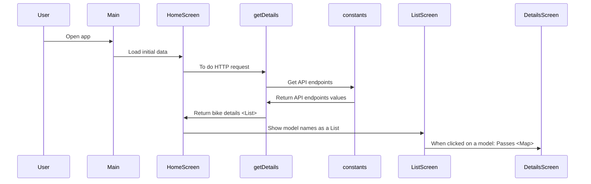

# MotoCyclopedia_2

This is a Flutter app which fetches motorcycle details from an API and shows it in the app.

## Dart Packages Required

- http: ^1.2.2
  > Import it as `import 'package:http/http.dart' as http;`
- flutter_launcher_icons: ^0.13.1
  > This is used to set the icon of the app.

## Structure of the Directories

+ lib
    + constants.dart - contains all the URLs and Api links.
    + services
        + getDetails.dart
            + getDetails() - sends Api request and fetch the bike details
    + screens
        + loadingScreen - #splash screen
        + Search Screen - #home screen
        + listScreen - #searchScreen -> #listScreen
        + detailsScreen - #listScreen-> detailsScreen
    + main.dart

## Sequence diagram of the App



## Implementation

### Creating constants

```dart
import 'package:flutter/material.dart';

// Constants
const urlBase = 'https://api.api-ninjas.com/v1/motorcycles?';
const apiKeyLabel = 'X-Api-Key';
const apiKeyValue = 'YOUR API KEY';


// widgits styling functions

TextStyle searchTextFieldStyle(context) {
  return TextStyle(
    color: Theme.of(context).colorScheme.onPrimaryContainer,
    fontSize: 18.0,
    fontWeight: FontWeight.w600
  );
}

TextStyle searchPlaceholderStyle(context) {
  return TextStyle(
    color: Theme.of(context).colorScheme.onPrimaryContainer,
    fontSize: 18.0,
    fontWeight: FontWeight.w100
  );
}
```

### Creating a function for handling API HTTP request: **services/getDetails.dart**
This function is responsible for sending HTTP request to the server to fetch details of a motorcycle.
```dart
import 'dart:convert';
import 'dart:io';

import 'package:http/http.dart' as http;
import 'package:motocyclopedia_2/constants.dart';

Future<List> getDetails ({make, model, year}) async {
  var param = '';
  if (make != null) param += 'make=$make&';
  if (model != null) param += 'model=$model&';
  if (year != null) param += 'year=$year&';
  final url = urlBase + param;

  http.Response response = await http.get(
    Uri.parse(url),
    headers: {apiKeyLabel: apiKeyValue},
  );

  if (response.statusCode == HttpStatus.ok) {
    final jsonResponse =jsonDecode(response.body);
    return jsonResponse;  // jsonResponse will be a list by default
  } else {
    return [-1];
  }

}
```

### Starting point of the project: main.dart
This file is the starting point of this flutter app. It has an stateless widget which redirects it to the HomeScreen.

```dart
import 'package:motocyclopedia_2/screens/home_screen.dart';

void main() {
  runApp(const MyApp());
}

class MyApp extends StatelessWidget {
  const MyApp({super.key});

  // This widget is the root of your application.
  @override
  Widget build(BuildContext context) {

    WidgetsFlutterBinding.ensureInitialized();

    // SystemChrome.setEnabledSystemUIMode(
    //   SystemUiMode.edgeToEdge,
    //   overlays: [SystemUiOverlay.top]
    // );
    return MaterialApp(
      title: 'MotoCyclopedia',
      theme: ThemeData(
        colorScheme: ColorScheme.fromSeed(seedColor: Colors.yellow),
        useMaterial3: true
      ),
      debugShowCheckedModeBanner: false,
      home: const HomeScreen(),
    );
  }
}
```

### HomeScreen
This is the HomeScreen of the app. It is the screen in which user would do the search request for a motorcycle.
It has a Stateful widget tree, and a **search()** function. After a successful search, it redirects to listScreen().

```dart
import 'package:flutter/cupertino.dart';
import 'package:flutter/material.dart';
import 'package:flutter/services.dart';
import 'package:motocyclopedia_2/constants.dart';
import 'package:motocyclopedia_2/screens/list_screen.dart';
import 'package:motocyclopedia_2/services/getDetails.dart';

class HomeScreen extends StatefulWidget {
  const HomeScreen({super.key});

  @override
  State<HomeScreen> createState() => _HomeScreenState();
}

class _HomeScreenState extends State<HomeScreen> {

  List bikes = [];

  // Text Editing Controllers
  TextEditingController? make = TextEditingController();
  TextEditingController? model = TextEditingController();
  TextEditingController? year = TextEditingController();

  Future search() async {
    bikes = await getDetails(make: make!.text, model: model!.text, year: year!.text);

    Navigator.of(context).push(
        MaterialPageRoute(builder: (route)=>ListScreen(bikesList: bikes,))
    );
  }

  @override
  Widget build(BuildContext context) {
    return Scaffold(
      appBar: AppBar(
        title: const Text('MotoCyclopedia',
            style: TextStyle(fontWeight: FontWeight.bold),
        ),
      ),
        body: Column(
          crossAxisAlignment: CrossAxisAlignment.center,
          children: [
            const SizedBox(height: 50,),
            Text('Know Your Motorcycle',
              style: TextStyle(
                color: Theme.of(context).colorScheme.onPrimaryContainer,
                fontWeight: FontWeight.bold,
                fontSize: 25,
              ),
            ),
            const SizedBox(height: 35,),
            Center(
              child: SizedBox(
                width: 300,
                height: 50,
                child: TextField(
                  controller: make,
                  style: searchTextFieldStyle(context),
                  decoration: InputDecoration(
                      filled: true,
                      fillColor: Theme.of(context).colorScheme.primaryContainer,
                      border: OutlineInputBorder(
                        borderSide: BorderSide.none,
                        borderRadius: BorderRadius.circular(50),
                      ),
                      hintText: 'Enter Maker',
                      hintStyle: searchPlaceholderStyle(context)
                  ),
                ),
              ),
            ),
            const SizedBox(height: 20,),
            SizedBox(
              width: 300,
              height: 50,
              child: TextField(
                controller: model,
                style: searchTextFieldStyle(context),
                decoration: InputDecoration(
                    filled: true,
                    fillColor: Theme.of(context).colorScheme.primaryContainer,
                    border: OutlineInputBorder(
                      borderSide: BorderSide.none,
                      borderRadius: BorderRadius.circular(50),
                    ),
                    hintText: 'Enter Model',
                    hintStyle: searchPlaceholderStyle(context)
                ),
              ),
            ),
            const SizedBox(height: 20,),
            SizedBox(
              width: 300,
              height: 50,
              child: TextField(
                controller: year,
                style: searchTextFieldStyle(context),
                decoration: InputDecoration(
                    filled: true,
                    fillColor: Theme.of(context).colorScheme.primaryContainer,
                    border: OutlineInputBorder(
                      borderSide: BorderSide.none,
                      borderRadius: BorderRadius.circular(50),
                    ),
                    hintText: 'Enter Year of Mfg.',
                    hintStyle: searchPlaceholderStyle(context)
                ),
              ),
            ),
            const SizedBox(height: 20,),
            ElevatedButton(
                onPressed: (){
                  if((year!.text != '' && (model!.text != '' || make!.text != '')) || (model!.text != '' || make!.text != '')){
                    setState(() {
                      search();
                    });
                  }
                },
                child: const Text('Search')),
          ],
        )
    );
  }
}
```

### The ListScreen : screens/list_screen.dart
This is the next screen which appears after a successful search. This is the screen which shows different models of motorcycles
as a list. On clicking on any list item, user will be redirected to DetailsScreen() which contains the full detail of that motorcycle.

```dart

import 'package:flutter/material.dart';

import 'details_screen.dart';

class ListScreen extends StatefulWidget {
  const ListScreen({super.key, required this.bikesList});

  final List bikesList;
  @override
  State<ListScreen> createState() => _ListScreenState();
}

class _ListScreenState extends State<ListScreen> {
  @override
  Widget build(BuildContext context) {
    return Scaffold(
      appBar: AppBar(title: const Text('Search Results'),),
      body: widget.bikesList.isEmpty ? ListIsNull() : ListIsNotNull(),
    );
  }

  Widget ListIsNull() {
    return Center(
      child: Column(
        mainAxisAlignment: MainAxisAlignment.spaceEvenly,
        children: [
          const Text('No results found!', style: TextStyle(fontSize: 25),),
          const SizedBox(height: 150,),
          IconButton(
            onPressed: (){
              Navigator.pop(context);
            },
            icon: const Icon(Icons.arrow_back),
            hoverColor: Theme.of(context).colorScheme.secondaryContainer,
            ),
        ],
      ),
    );
  }

  Widget ListIsNotNull() {
    return ListView.builder(
        itemCount: widget.bikesList!.length ?? 0,
        itemBuilder:(BuildContext context, int position) {
          return Card(
            color: Colors.white,
            elevation: 2.0,
            child: ListTile(
              title: Text(widget.bikesList![position]['model'], style: const TextStyle(fontWeight: FontWeight.bold),),
              subtitle: Row(
                mainAxisAlignment: MainAxisAlignment.spaceBetween,
                children: [
                  Text('Model: ${widget.bikesList![position]['make']}'),
                  Text('Year: ${widget.bikesList![position]['year']}'),
                ],
              ),
              onTap: () => Navigator.of(context).push(
                  MaterialPageRoute(builder: (route) => DetailsScreen(
                      bikeDetails: widget.bikesList![position]
                  ))
              ),
            ),
          );
        }
    );
  }
}

```

### DetailsScreen : screens/details_screen.dart
This is the Screen in which user will find a full detail of a motorcycle model.
This screen contains a stateless widget tree to show the details.

```dart
import 'package:flutter/material.dart';

class DetailsScreen extends StatelessWidget {
  const DetailsScreen({super.key, required this.bikeDetails});
  final Map bikeDetails;
  @override
  Widget build(BuildContext context) {
    List? detailsList = bikeDetails.entries.toList();

    return Scaffold(
      appBar: AppBar(
        title: const Text('Details'),
      ),
      body: ListView.builder(
        itemCount: detailsList!.length,
        itemBuilder: (context, index) {
          var info = detailsList[index];
          return Card(
            color: Colors.white,
            elevation: 1.0,
            child: ListTile(
              // title: Text('${info.key} : ${info.value}'),
              title: RichText(
                text: TextSpan(
                    style: TextStyle(
                        fontWeight: FontWeight.bold,
                        color: Theme.of(context).colorScheme.primary
                    ),
                    children: [
                      TextSpan(text: info.key.toString().toUpperCase(),
                          style: TextStyle(
                            fontWeight: FontWeight.bold,
                            color: Theme.of(context).colorScheme.onPrimaryContainer
                          )
                      ),
                      const TextSpan(text: ' : '),
                      TextSpan(text: info.value.toString().toUpperCase()),
                    ]
                ),

              ),
            ),
          );
        },
      ),
    );
  }
}
```

### For icons, **flutter_launcher_icons: ^0.13.1** package has been used. Just Google, how to use it.

### Thank-you!

